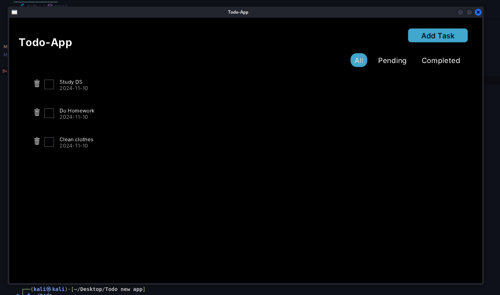
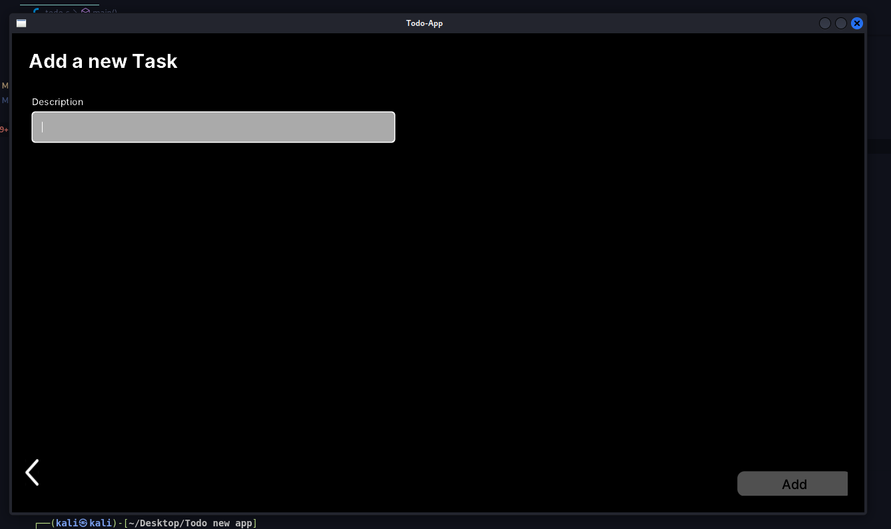

# Todo-new-app Using C 🚀

> ****This will only run on a Linux machine 🐧****
This project contains the Todo-new-app C program, which integrates the leif library. Follow the instructions below to set up the project and install the necessary dependencies.

This Todo app uses C, OpenGL (via GLFW), and Leif (a lightweight UI framework) to provide a GUI for managing tasks.

### Screenshots 📸

Below are some screenshots of the Todo-new-app in action:

- **Task List View**:

  
- **Adding a New Task**:

  

## Key Features: 🌟

- **Task Data Structure**: Tasks are stored in a linked list (task_entry), each with a description, date, and completion status.
- **UI Elements**: The interface includes buttons for adding and deleting tasks, input fields for task descriptions, and checkboxes for marking completion. 👍
- **Task Filtering**: Tasks can be filtered (All, Pending, Completed) with dynamic rendering. 🔄
- **Main Loop**: The app updates the UI based on user interactions and handles task management (add, delete, and filter tasks).
- The app provides a simple, efficient way to manage tasks with a flexible UI and backend structure.

## Project Setup 🔧

### Prerequisites 📋

Ensure you have the following installed:

- Git
- Make (or CMake if applicable)
- GCC or another C compiler
- GLFW, OpenGL, Leif, clipboard, and xcb libraries

### Clone the Repository 📂

Clone the Todo-new-app repository and install the dependencies:

```bash
git clone https://github.com/AbinVarghexe/Todo-new-app.git
cd Todo-new-app
```

### Running the Installation Script 🚦

To automatically install the necessary dependencies and set up the project, run the install.sh script:

```bash
chmod +x install.sh
./install.sh
```

This script will:

- Clone the Todo-new-app repository.
- Install any C dependencies using make (or cmake if configured).
- Clone the leif repository.
- Install leif and set it up for use with your project.

### Installation Steps in the Script 📜

The install.sh script performs the following actions:

- **Clones the Todo App repository**:

  ```bash
  git clone https://github.com/AbinVarghexe/Todo-new-app.git
  ```
- **Navigates into the Todo App directory**:

  ```bash
  cd Todo-new-app
  ```
- **Installs the necessary C dependencies using make**:

  ```bash
  make
  ```
- **Clones the Leif repository**:

  ```bash
  git clone https://github.com/cococry/leif.git
  ```
- **Navigates to the Leif directory and installs it**:

  ```bash
  cd leif
  make
  ```
- **Links or copies the Leif library to the project directory**:

  ```bash
  cd ..
  cp -r leif /path/to/your/project/directory
  ```

## Building and Running the Application 🚀

After completing the installation, you can build and run the Todo-new-app using the following commands:

```bash
gcc -o todo todo.c -lglfw -lGL -lleif -lclipboard -lm -lxcb
./todo
```

This will compile the todo.c file, linking it with necessary libraries such as glfw, GL, leif, clipboard, math, and xcb, and then run the resulting Todo application. 🏃‍♂️💻

## Todo App Logic Implementation

### Overview

The logic.c file contains the core logic for the Todo app. It handles the task management system, including adding, deleting, and filtering tasks. To run and test the logic, follow the instructions below.

### Running the Logic File

#### Prerequisites

You need to have GCC (GNU Compiler Collection) installed on your system.
Navigate to the root directory of your project where the Todo-new-app folder is located.

#### Steps to Run the Logic

- **Navigate to the logic folder**:
  Open a terminal and change your directory to the folder containing the logic.c file. Assuming you are starting from the root project directory:

  ```bash
  cd Todo-new-app/logic
  ```
- **Compile the logic.c file**:
  Use the gcc command to compile the logic.c file:

  ```bash
  gcc logic.c -o logic
  ```
- **Run the compiled program**:
  After successful compilation, run the program with the following command:

  ```bash
  ./logic
  ```

This will execute the logic in the logic.c file and allow you to interact with the task management system.

## Contributions 🙌

We welcome contributions! If you'd like to contribute to the development of Todo-new-app, feel free to fork the repository and submit a pull request.

### Steps to Contribute:

1. Fork the repository.
2. Create a new branch for your feature.
3. Commit your changes.
4. Push to your forked repository.
5. Create a pull request.

Thank you for helping improve the project! 💡
